# Systems Thinking, Architecture & Exhaustive Pre-Mortem Analysis

> **Guiding Principle**: We are building OpenTools to last forever. A forever system cannot depend on venture capital subsidies, cloud server compute budgets, fragile third-party APIs, or ephemeral trends. It must be anti-fragile, economically self-sustaining, cryptographically sound, and verifiable at any moment in time.

---

## 1. High-Level Systems Architecture

```mermaid
graph TD
    subgraph ClientTab [User Browser Sandbox]
        UI[Operator v1 Interface] --> StateManager[Parameter & File State]
        StateManager --> WorkerPool[Web Worker Execution Pool]

        subgraph ComputeRuntimes [Zero-Egress Compute Runtimes]
            WorkerPool --> WASM[WebAssembly Binary Modules: pdf-lib, codecs]
            WorkerPool --> WebCrypto[Native Web Crypto API: 256-bit AES-GCM]
            WorkerPool --> AudioCtx[Web Audio API: OfflineAudioContext]
            WorkerPool --> Canvas[OffscreenCanvas Pixel Processing]
        end

        ComputeRuntimes --> LocalOutput[Ephemeral Memory Buffers]
        LocalOutput --> DownloadTrigger[Instant Blob Save]
        DownloadTrigger --> RevokeMem[URL.revokeObjectURL Immediate Buffer Zeroing]
        DownloadTrigger --> ValueReceipt[Verified Speed Receipt + Voluntary Support]
    end

    subgraph DiscoveryEngine [Organic Acquisition Flywheel]
        CatalogCSV[(1,000-Tool Catalog)] --> LinkingGraph[Bidirectional Topic Cluster Mesh]
        LinkingGraph --> CategoryPillars[19 Category Pillar Hubs]
        LinkingGraph --> ToolGuides[1,000 Programmatic Technical Guides]

        ToolGuides --> AEOBlocks[AEO Direct Answer Snippets]
        ToolGuides --> GEOGraph[GEO Semantic Entity Knowledge Graph]
        ToolGuides --> Flowcharts[Monochrome Architecture Flowcharts]

        CategoryPillars --> Sitemap[Dynamic sitemap.xml 1,055 URLs]
        ToolGuides --> Sitemap
        Sitemap --> SearchEngines[Google, Perplexity, ChatGPT Search, Claude]
    end

    subgraph AuditLedger [Continuous Governance & Integrity]
        AgentActions[Agent Modifications] --> AppendLog[docs/agent_ledger.jsonl]
        AgentActions --> HandoffDoc[docs/handoffs/HANDOFF_LATEST.md]
        AgentActions --> QCGate[8-Stage Automated QC Pipeline]
    end
```



---

## 2. Exhaustive Pre-Mortem: What Could Go Wrong in the Future & Rock-Solid Mitigations

A pre-mortem assumes the project has failed 5 years from now and asks: _Why did it fail?_
By anticipating every plausible point of failure today, we engineer self-healing defenses directly into the architecture.

### Failure Vector 1: Accidental Network Egress (Data Privacy Breach)

- **The Scenario**: A future contributor or AI model adds a third-party font, analytics tracker (e.g. Google Analytics), or error reporting library (e.g. Sentry) that sends user telemetry to a remote server.
- **Why It\x27s Fatal**: Destroys our foundational value proposition: _"0 bytes uploaded to any server"_.
- **The Rock-Solid Defense**:
  1. Strict CSP Header in `next.config.ts`: `connect-src \x27none\x27; form-action \x27none\x27; object-src \x27none\x27;`. Modern browsers actively block network calls at the protocol level.
  2. Automated Static Policy Gate (`lib/tools/local-source-policy.test.ts`): Scans every file under `lib/tools`, `workers`, `components`, and `app` for network primitives (`fetch`, `XMLHttpRequest`, `WebSocket`, `EventSource`, and literal `https://`). The build fails instantly if any network construct is introduced.

### Failure Vector 2: Google Search Programmatic Penalty (Thin Content Accusation)

- **The Scenario**: Google crawls 1,000 tool guides, classifies them as low-quality programmatic duplicate content, and de-indexes the domain.
- **Why It\x27s Fatal**: Organic search inflow collapses to zero.
- **The Rock-Solid Defense**:
  1. **Parametric Specificity**: No generic boilerplate. Every tool has customized technical descriptions, unique 3-step How-To procedures, distinct problem-solution framing, and tailored FAQs.
  2. **Topic Cluster Architecture**: Rather than 1,000 flat, isolated URLs, pages are organized into 19 Category Pillar Hubs with deep bidirectional internal links.
  3. **High Information Density**: Every guide includes structured comparison matrices, direct answer blocks, SVG architecture flowcharts, and Schema.org JSON-LD markup.

### Failure Vector 3: Memory Exhaustion on Large Media Files (Browser Crashes)

- **The Scenario**: A user loads a 400MB video or 150-page PDF, crashing the browser tab due to Out-Of-Memory (OOM) errors.
- **Why It\x27s Fatal**: Frustrated users abandon the tool and leave negative reviews.
- **The Rock-Solid Defense**:
  1. **Zero-Copy Worker Transfer**: Replaced buffer cloning with transferable array buffers (`toTransferableBuffer()`), cutting worker memory overhead by 50%.
  2. **Fast Pixel Arithmetic**: Avoided expensive exponentiation (`** 2`) in image processing loops, optimizing CPU cache lines.
  3. **Ephemeral Memory Hygiene**: Explicit `URL.revokeObjectURL()` calls immediately after download, releasing device RAM back to the operating system.

### Failure Vector 4: Search Engine Crawl Budget Exhaustion

- **The Scenario**: Googlebot expends its daily crawl quota on low-priority or repetitive paths and fails to discover high-value conversion tools.
- **Why It\x27s Fatal**: Key high-demand tools take months to get indexed.
- **The Rock-Solid Defense**:
  1. **Tiered Dynamic Sitemap**: `app/sitemap.ts` explicitly assigns priority weights:
     - Home: `1.0` (daily)
     - Core Workspace Routes: `0.9` (weekly)
     - Category Pillar Hubs: `0.9` (weekly)
     - High-Demand P0 Tool Guides: `0.85` (weekly)
     - Backlog P1/P2 Tool Guides: `0.75` (weekly)
  2. **Clean URL Structures**: Zero query parameters or dynamic session IDs in sitemaps; clean canonical headers on every page.

### Failure Vector 5: Context Drift Across Autonomous AI Agents

- **The Scenario**: Different AI models or development sessions make contradictory changes, overwrite performance optimizations, or break design guidelines.
- **Why It\x27s Fatal**: Architecture decays into technical debt and regression bugs.
- **The Rock-Solid Defense**:
  1. **Immutable Agent Ledger** (`docs/agent_ledger.jsonl`): Every change is recorded with timestamps, agent identity, files modified, and rationale.
  2. **Canonical Handoff Document** (`docs/handoffs/HANDOFF_LATEST.md`): Serves as the single source of truth for the next agent picking up work.
  3. **Mandatory 8-Stage Quality Gate** (`scripts/run-qc.mjs`): Automated, non-negotiable pipeline executing format checks, unit tests, strict typechecking, linting, design token validation, full builds, SBOM generation, and blueprint integrity in under 7 seconds.

---

## 3. Economic Sustainability Model: Free Forever via Emotional Support

```text
Legacy SaaS Converters (Smallpdf / Zamzar):
User -> 1 Free Conversion -> Paywall Trap -> $12/mo Recurring Subscription -> High Churn & Frustration

OpenTools Forever Model:
User -> Instant Sub-Second Execution -> 100% Free Download -> Verified Speed Receipt
     -> High-Conversion Emotional Support Pitch ("Support Independent Open-Source")
     -> Voluntary $3 / $10 / $25 Tips -> Funds Testing Matrix & Zero Cloud Compute Costs
```

Because all computing happens on the user\x27s device, our server hosting costs are virtually zero (static edge CDN bandwidth only). A conversion rate of just 0.5% on voluntary tips generates massive net profitability, while ensuring 100% of utilities remain permanently free and accessible to all students, developers, and enterprises worldwide.
